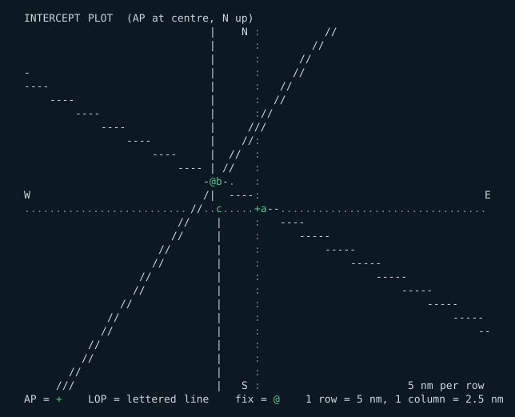
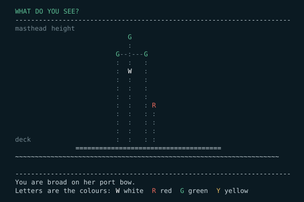
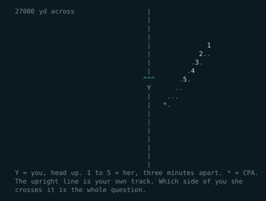
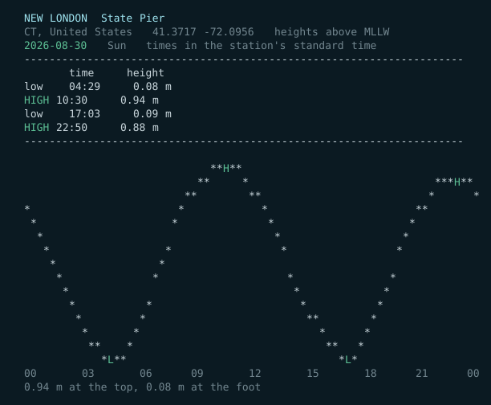
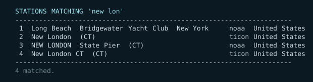
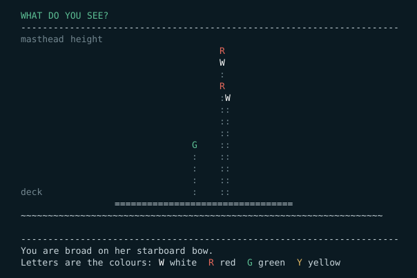

# Bash Navigation Software

Marine navigation tools written in POSIX shell and awk. No dependencies, no
network, no data files that expire. Each tool is a single file you can copy onto
anything with a shell — including an iPad.

Three of them:

| | |
|---|---|
| **[celnav](#celnav)** | Celestial navigation: a computed almanac, sight reduction, the fix, and a training mode that teaches the whole subject from first principles. |
| **[colregs](#colregs)** | The international rules of the road: lights and shapes drawn from any angle, encounter scenarios, sound signals, contact management, and lessons on the rules themselves. |
| **[tides](#tides)** | Harmonic tide prediction for 8,334 stations worldwide: the day's table, the curve, the moon and sun, and the question a tide table exists to answer &mdash; is there enough water. Overhead clearance too, where there are bridges. |
| **[deck-log](#deck-log)** | The boat's records &mdash; deck, engine, provisions &mdash; kept append-only in UTC, with the spares worked out by replaying the log rather than stored. |
| **[weather](#weather)** | Read your own barometer. Reasons over the observations in your deck log and **shows its working** &mdash; the pressure tide, backing and veering, Buys Ballot, fog, cloud base, the warm-front cloud sequence, swell as the earliest warning there is &mdash; and teaches the physics underneath in ten lessons. Then you forecast, it forecasts, and both are scored. |



<details>
<summary>the same thing as text, to copy</summary>

```
  INTERCEPT PLOT  (AP at centre, N up)
                               |    N :          //
                               |      :        //
                               |      :      //
  -                            |      :     //
  ----                         |      :   //
      ----                     |      :  //
          ----                 |      ://
              ----             |     ///
                  ----         |    //:
                      ----     |  //  :
                          ---- | //   :
                              -@b-.   :
  W                           /|  ----:                                   E
  ..........................//..c.....+a--.................................
                          //    |     :   ----
                         //     |     :      -----
                       //       |     :          -----
                      //        |     :              -----
                    //          |     :                  -----
                   //           |     :                      -----
                 //             |     :                          -----
               //               |     :                              -----
              //                |     :                                  --
            //                  |     :
           //                   |     :
         //                     |     :
       ///                      |   S :                       5 nm per row
  AP = +    LOP = lettered line    fix = @    1 row = 5 nm, 1 column = 2.5 nm
```

</details>

---

## Why it is built this way

**It has to work when nothing else does.** No internet, no app store, no
almanac to buy, nothing that runs out at the end of the year. `celnav`'s almanac
is computed from orbital theory built into the script.

**It has to run on whatever shell you can get.** POSIX `sh` plus `awk` is the
largest common denominator across iSH and a-Shell on iOS, Termux on Android,
macOS, Linux and the BSDs. There is no build step and nothing to install.

**One file per tool.** Each program carries its own engine inside it as text and
writes it out on first run. Moving a tool to a new device is moving one file.

**The working is visible.** Every intermediate value is printed. If an answer
looks wrong you can see where it went wrong, and you can continue by hand from
any line of the output. These are assistants, not black boxes.

---

## Install

Copy the file, make it executable, run it. That is the whole procedure.

```sh
git clone https://github.com/larrys614/bashnav.git
cd bashnav
./bin/celnav doctor        # checks your awk, your clock and the data folder
./bin/colregs about
```

To put them on your path:

```sh
mkdir -p ~/bin && cp bin/celnav bin/colregs ~/bin/ && chmod +x ~/bin/celnav ~/bin/colregs
```

**On macOS, Linux or a BSD** there is nothing to install. `celnav doctor` will
confirm it.

**On an iPad.** Both tools run under [iSH](https://ish.app) and
[a-Shell](https://holzschu.github.io/a-Shell_iOS/). Under iSH *only*, install an
awk with the maths library first — the BusyBox one is sometimes built without it:

```sh
apk add gawk        # iSH only. apk is Alpine's package manager and
                    # does not exist on macOS.
```

a-Shell already has a suitable awk. `celnav doctor` will tell you either way, and
names the fix if something is missing.

---

## celnav

Celestial navigation, offline.

- **Sight reduction** with the full working printed: GHA, declination, LHA, dip,
  refraction, parallax, semi-diameter, Hc, Zn, intercept.
- **The fix** by least squares from any number of sights, then re-reduced from
  its own answer until the position stops moving — so the intercept method's
  straight-line approximation is not a source of error however far out your DR is.
- **Running fix**: set course and speed and every line of position is advanced
  to the fix time for you.
- **Sight planning**: twilight times in UT and local, what is above the horizon,
  and the best three bodies to shoot.
- **Fix geometry** reported in miles, so a weak cut is named as weak.
- **Training mode**: twenty lessons, an annotated walkthrough of one real sight,
  six kinds of marked drill, and a sandbox for the navigational triangle.

```
  FIX   35 09.9'N   040 20.0'W
  Offset from DR: 9.9 nm N, 16.4 nm W   (19.2 nm on 301 T)

  LOP residuals at the fix (nm):
    a Dubhe      Zn 027 T   intercept from DR    1.5   residual  +0.01
    b Bellatrix  Zn 128 T   intercept from DR  -19.0   residual  +0.01
    c Markab     Zn 269 T   intercept from DR   16.2   residual  +0.01
    RMS scatter 0.01 nm  -  this is the quality of your sights
```

### Accuracy

Checked against an independent high-precision ephemeris over 1990–2076, sampling
every 11 days. Errors are total angular difference in apparent position:

| Body | RMS | Worst |
|---|---|---|
| The 57 navigational stars and Polaris | 0.005' | 0.011' |
| Sun | 0.06' | 0.22' |
| Moon | 0.11' | 0.33' |
| Venus, Mars | 0.06–0.09' | 0.42' |
| Jupiter, Saturn | 0.01–0.03' | 0.06' |

One arcminute is one nautical mile, so the almanac contributes well under half a
mile everywhere. Your sextant and your clock are the limiting factors, which is
how it should be.

The fix arithmetic was checked separately against 200 randomised worldwide cases
with exact synthetic sights, reduced from a DR up to 25 miles away: every case
with sound geometry recovered the true position within **0.11 nm**.

`celnav test` re-runs a 14-point version of that check offline, in about a second.

Full manual: [docs/celnav-manual.pdf](docs/celnav-manual.pdf) ·
one-page card: [docs/celnav-quickref.pdf](docs/celnav-quickref.pdf)

---

## colregs

The rules of the road, drawn in characters.

- **Lights** from a physical model. Each light is described by its position,
  height and arc of visibility, so any vessel can be drawn from any angle and
  the arcs decide what you can see. Twenty vessel types. It asks the two
  questions a lookout asks — what is she, and which way is she going — and
  refuses to offer you two answers that would look identical from that bearing.
- **Day shapes** — ball, diamond, cone, cylinder and the rest.
- **Encounters** — a head-up plan view, and the question that matters: who keeps
  out of the way, and what do you actually do. Twenty-eight scenarios, each with
  the rule that governs it: crossing and head-on, narrow channels, traffic
  separation schemes, restricted visibility, tows, and vessels aground.
- **Collision avoidance** — a developing situation instead of a snapshot. Three
  timed observations of bearing and range, with realistic scatter; you work out
  whether there is risk, how close she will come, and what to do. Then the worked
  solution and a frame-by-frame replay of both tracks under *your* answer, so you
  see the CPA your action actually produced.
- **Sound signals** drawn as timelines, since a script cannot make a noise.
- **Fifteen lessons** on the rules themselves, each with a check question.



<details>
<summary>the same thing as text, to copy</summary>

```
  WHAT DO YOU SEE?
  ----------------------------------------------------------------------
  masthead height
                              G
                              :
                           G--:---G
                           :  :   :
                           :  W   :
                           :  :   :
                           :  :   :
                           :  :   :
                           :  :   : R
                           :  :   : :
                           :  :   : :
                           :  :   : :
  deck                     :  :   : :
                 =====================================
  ~~~~~~~~~~~~~~~~~~~~~~~~~~~~~~~~~~~~~~~~~~~~~~~~~~~~~~~~~~~~~~~~~~~
  
  ----------------------------------------------------------------------
  You are broad on her port bow.
  Letters are the colours: W white  R red  G green  Y yellow
```

</details>

Every light also carries its colour as a letter, so the pattern is unambiguous
in night mode, in plain mode, and for anyone who does not see red and green.

---

### Contacts

Bearing drift, the report, and the tracking watch — the method a fire
control tracking party uses, written down. Five marks three minutes apart,
and you call the drift, where she goes, and her CPA before the plot can.



A bearing drawing **away** from your bow passes astern of you. A bearing
drawing **toward** it crosses ahead. That is not a rule of thumb: relative
motion is a straight line, so the bearing sweeps one way and can never come
back. The test suite re-checks it against four hundred fresh geometries on
every run.

---

## tides

Harmonic prediction from constants measured at each station. **8,334
stations**: 6,090 with their own harmonic constants and 2,244 that offset
from a neighbour, which is exactly how a printed tide table is built.

```sh
tides near 41.2333 -72.0833     # stations nearest a position
tides find "new lon"            # or by name, loosely, or by regex
tides use noaa/8461490          # choose one
tides today                     # the table, the curve, and where you are on it
tides sky                       # the same, with the moon and the sun
```



**A tide cannot be computed from a position.** It depends on the shape of
the coast and the depth and resonance of the basin, so every place needs
constants somebody measured there over a year or more. That is why you
pick a station rather than a place &mdash; and why the nearest one by
straight line can be on the wrong side of a headland and behave nothing
like you.

### Finding a station

Nobody guesses a station's exact name. The database calls a place
`NEW LONDON  State Pier`, or `Chappaquoit Point  West Falmouth Harbor`.
So type part of it and pick from the numbered list:

```
  STATIONS MATCHING 'new lon'
  ----------------------------------------------------------------------
   1  Long Beach  Bridgewater Yacht Club  New York     noaa  United States
   2  New London  (CT)                                 ticon United States
   3  NEW LONDON  State Pier  (CT)                     noaa  United States
   4  New London CT  (CT)                              ticon United States
  ----------------------------------------------------------------------
  4 matched.
  Number to use it, or return to search again:
```

Every word you type has to appear somewhere in the name, the state or the
country &mdash; but in any order, and anywhere inside a word. `lon new`
finds New London just as well as `new london` does. Names that *are* what
you typed sort above names that merely contain it.

The text becomes a **regular expression** the moment it contains any of
`^ $ . [ ] | ( ) * + ? { } \`, matched against the name, the state and
the country separately so that anchors anchor where you expect:

```sh
tides find "^st mary"         # names that start with St Mary
tides find "bay$"             # names that end in Bay
tides find "falmouth|mystic"  # either one
tides find "port.*bay"        # Port, then anything, then Bay
tides find "^boston$"         # only the stations actually called Boston
```

A pattern that is not a valid regular expression is checked before it is
used and searched as plain text instead &mdash; awk cannot catch a bad
pattern, it simply dies, and refusing to answer is worse than answering
the obvious way.

### Accuracy

Checked against **NOAA's own published tables**, not against another
implementation of the same theory. Twenty-four high and low waters at six
stations spanning small and large ranges, mixed and diurnal regimes:

| | |
|---|---|
| mean error in time | **2.4 minutes** |
| worst | 5.9 minutes |
| mean error in height | **1.0 cm** |
| worst | 2.0 cm |

The fixture is committed, so the check runs with no network like everything
else here.



**A tide height is not a tidal stream.** The rise and fall is the vertical;
set and drift is the horizontal, and the two are different measurements made
at different places. They are related, but locally: in a standing-wave basin
the stream runs hardest at half-tide and goes slack at high and low water,
while in a progressive wave the flood peaks *at* high water &mdash; which one
you are in depends on the shape of the coast, the same reason a tide cannot be
computed from a position. The 8,334 stations here are height stations. Nothing
in this tool predicts a current.

**What it does not know is the weather.** A deep low can raise the sea half
a metre above prediction and a hard high can drop it as far; wind piles
water onto a lee shore and drains a weather one. A prediction is the
astronomical tide and nothing else.

Times are the station's own standard time &mdash; no summer time, exactly
like a printed table, because that is what the offsets in the data are
referenced to.

Data: NOAA harmonic constants (public domain) and TICON-4 (CC BY 4.0),
assembled by way of the [neaps tide-database](https://github.com/neaps/tide-database)
project. That attribution travels with the data; see [NOTICE](NOTICE).

---

---

## deck-log

The boat's records &mdash; deck, engine, provisions &mdash; in one place,
because they are the same book with different tabs, written by the same person
at the same moment.

```sh
deck-log                   # the menu; the three-hourly entry
deck-log inspect           # the engine checklist
deck-log job               # work done, and the part it used
deck-log shopping          # the list for the next port
deck-log what -72          # what the log says about the weather
```

**A log is a record.** It has standing after an incident and is read by people
who were not there. So it is **append only** &mdash; nothing is ever edited or
deleted &mdash; a **correction is a new entry** that references the old one with
both visible for ever, which is the electronic version of lining through and
initialling, and **every timestamp is UTC**.

**Declining is an answer.** Return records `-`, meaning asked and not taken;
`/` means it could not be observed. Both are true entries, and both beat a
guess. A form that punishes blanks gets invented numbers, and an invented
number in a log is worse than a gap because it looks like data. Zero is a
reading: "cloud nil" and "cloud not observed" are different facts and this log
tells them apart.

**Nothing is stored twice.** What an impeller *is* &mdash; its number, what it
fits, how many to carry &mdash; is registry. How many you *have* is worked out
by replaying the log, so the count can never disagree with the log, because it
is the log.

<details>
<summary>the shopping list, which is the screen it is really for</summary>

```

  SHOPPING LIST                     Cape Town
  ----------------------------------------------------------------------
  raw water impeller       x1   have 1, want 2
    Jabsco 17937-0001
    fits: Yanmar 4JH4-TE  s/n E12345
    stow: port bilge, box 3

  ----------------------------------------------------------------------
  Everything the chandler will ask, on one screen, with no signal.
```

Everything the chandler will ask, on one screen, with no signal.

</details>

---

## weather

Read your own barometer. It reasons over the observations in your deck log and
**shows its working**, and it teaches the physics underneath.

```sh
weather what               what your log says is coming, and why
weather learn coriolis     a lesson; no key lists them
weather chart              reason over a 500 mb radiofax chart
weather forecast           yours first, then mine, then both are scored
weather score              how you, the rules and persistence are doing
```

**It cannot forecast, and says so.** No model, no GRIB, no chart it did not get
from you by hand. What it works from is the one category of weather data that is
never wrong &mdash; what you measured yourself &mdash; and the only one still
available when the antenna comes down. Celestial is what you do when GPS dies;
this is what you do when the sat comms die.

### What it reasons about

Barometric tendency **corrected for the daily atmospheric tide** and told out
loud &mdash; in the tropics the glass falls two to three millibars every
afternoon in fine weather, and a sailor who does not know that reads it as a
system approaching. Backing and veering. Buys Ballot. Fog from dew point against
sea temperature. Cloud base from the spread. The **cloud sequence** &mdash;
cirrus thickening to altostratus to nimbostratus, a warm front announcing itself
hours ahead. And long-period swell from a new direction, which outruns the storm
that made it and is often the first news you get.

### The lessons

Ten, and the rule for all of them is that **a piece of physics has to earn its
place by changing what the app says or what you would do** &mdash; otherwise it
is a lecture with a barometer attached.

| | |
|---|---|
| `fluid` | air is a fluid, and warm moist air is *lighter* than warm dry air |
| `data` | observation, analysis, model &mdash; and why a GRIB is the one to distrust |
| `tide` | the atmospheric tide, and the afternoon fall that means nothing |
| `coriolis` | not a force, and why no cyclone forms on the equator |
| `gradient` | friction, and translating a chart into what you get on deck |
| `lapse` | stability, the inversion, and where the cloud base is |
| `cells` | the heat engine, and why the deserts are at 30 degrees |
| `h500` | the 500 millibar chart and the 564 line |
| `cyclone` | the five ingredients, and avoidance as a relative-motion problem |
| `seasons` | the tilt &mdash; and an honest note on where this stops mattering |

One of them says plainly where the physics stops being any of a sailor's
business. Padding a tool with material that cannot change a decision is the
failure the rule exists to prevent.

### The 564 line

A 500 mb chart arrives by **HF radiofax** &mdash; an SSB receiver, at sea, no
connectivity. Read three numbers off it and `weather chart` walks the rules:
the storm track lies 300&ndash;600 nm poleward of the 5640 m contour and
parallel to it; **all the gale force winds are on its poleward side**, which is
the routing rule; systems move at a third to a half of the 500 mb wind; and the
surface wind behind one is about half of it.

From Sienkiewicz and Chesneau's *Mariner's Guide to the 500-Millibar Chart*
(NOAA, public domain) &mdash; see [docs/SOURCES.md](docs/SOURCES.md).

### And it keeps score

`weather forecast` asks for **your** forecast first and writes it down before
showing any of its own. Then it offers two: the rule set, and **persistence**
("in twelve hours it will be much as it is now"), which is the honest floor.
When the valid time comes, all three are marked:

```
             points  per field, points per forecast
  you           2.0   dir 0.0  spd 1.0  hPa 1.0
  rules        13.6   dir 3.6  spd 8.0  hPa 2.0
  persist      14.0   dir 2.0  spd 5.0  hPa 7.0
```

Weighted error points from the WxChallenge &mdash; half a point per knot, one
per millibar, a tenth per degree &mdash; so a near miss scores like one. Scoring
the rules as well as you is the point: it keeps the tool honest, it teaches you
*when* a rule of thumb holds, and it lets you beat it.

---

## Colour and night vision

Three modes, remembered between sessions: `day`, `night`, `plain`.

Night mode is deep red on black with highlights in brighter red, and contains no
green at all. Rebuilding dark adaptation takes about twenty minutes and a bright
screen costs every one of them.

Plain mode emits no escape sequences, and is chosen automatically whenever
output is not a terminal — so redirected output is always clean text.

```sh
celnav night
colregs night
```



<details>
<summary>the same thing as text, to copy</summary>

```
  WHAT DO YOU SEE?
  ----------------------------------------------------------------------
  masthead height
                                      R
                                      W
                                      :
                                      R
                                      :W
                                      ::
                                      ::
                                      ::
                                 G    ::
                                 :    ::
                                 :    ::
                                 :    ::
  deck                           :    ::
                   =================================
  ~~~~~~~~~~~~~~~~~~~~~~~~~~~~~~~~~~~~~~~~~~~~~~~~~~~~~~~~~~~~~~~~~~~
  
  ----------------------------------------------------------------------
  You are broad on her starboard bow.
  Letters are the colours: W white  R red  G green  Y yellow
  Sideways spacing is where the lights sit along her hull, close to.
  Annex I keeps sidelights abaft the forward masthead light, so a
  sidelight falls toward her stern here, never toward her bow. And
  at a bow aspect you see across her beam more than along her length,
  so her green swings left - as it does bow-on. Not a heading cue:
  at any real range every one of them is in line.
```

</details>

---

## Safety

**These are training and cross-checking tools, not certified navigation
equipment.** Read [SAFETY.md](SAFETY.md) before you rely on either of them at
sea. The COLREGs as published by the IMO are what govern; where `colregs` and
the Convention differ, the Convention is right and this program is wrong.

---

## Tests

```sh
./tests/run-tests.sh                              # with whatever sh and awk you have
SHELLS="dash bash" AWKS="mawk gawk" ./tests/run-tests.sh   # the full matrix
```

The suite checks the almanac against embedded reference positions, reduces a
known set of sights to a known fix, renders every lesson, and — importantly —
checks that every drill and quiz marks its own correct answer as correct. That
last test is what caught mawk re-seeding `srand()` from the clock.

## How it is built

If you want to change something, or you are picking this up after a gap:

| | |
|---|---|
| [`CLAUDE.md`](CLAUDE.md) | start here &mdash; the rules that break things silently |
| [`docs/ARCHITECTURE.md`](docs/ARCHITECTURE.md) | how the tools are built and why they are shaped this way |
| [`docs/HACKING.md`](docs/HACKING.md) | the portability traps, and the bug that taught each one |
| [`docs/TESTING.md`](docs/TESTING.md) | what the suite checks, and what still needs a human |
| [`REPO-STATE.md`](REPO-STATE.md) | where things stand and what is next |

```sh
./build.sh              # src/ -> bin/ ; run after any edit to src/
./tests/run-tests.sh    # every shell x every awk on the machine
```

`bin/` is generated. Never edit it &mdash; CI checks that it matches `src/`.

---

## Contributing

See [CONTRIBUTING.md](CONTRIBUTING.md). Corrections to the COLREGs content and
to the astronomy are especially welcome, and please say which edition or source
you are working from.

## Licence

Apache License 2.0. See [LICENSE](LICENSE) and [NOTICE](NOTICE).

You may use it, including commercially, modify it, and redistribute it.
You must keep the copyright and licence notices and state what you
changed; you get an explicit patent grant; you may not use the author's
name to endorse your version.
