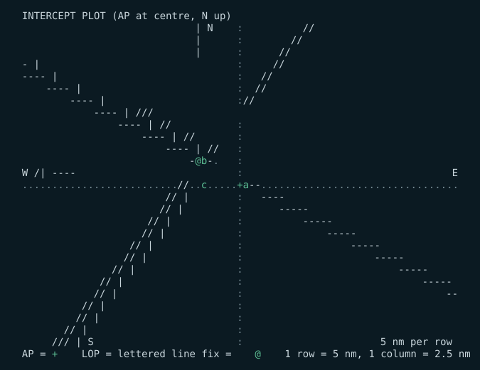
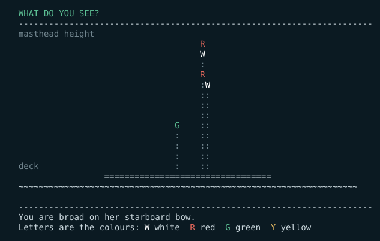

# Bash Navigation Software

Marine navigation tools written in POSIX shell and awk. No dependencies, no
network, no data files that expire. Each tool is a single file you can copy onto
anything with a shell — including an iPad.

Two of them so far:

| | |
|---|---|
| **[celnav](#celnav)** | Celestial navigation: a computed almanac, sight reduction, the fix, and a training mode that teaches the whole subject from first principles. |
| **[colregs](#colregs)** | The international rules of the road: lights and shapes drawn from any angle, encounter scenarios, sound signals, and lessons on the rules themselves. |



<details>
<summary>the same thing as text, to copy</summary>

```
  INTERCEPT PLOT  (AP at centre, N up)
                               |    N :          //
                               |      :        //
                               |      :      //
  -                            |      :     //
  ----                         |      :   //
      ----                     |      :  //
          ----                 |      ://
              ----             |     ///
                  ----         |    //:
                      ----     |  //  :
                          ---- | //   :
                              -@b-.   :
  W                           /|  ----:                                   E
  ..........................//..c.....+a--.................................
                          //    |     :   ----
                         //     |     :      -----
                       //       |     :          -----
                      //        |     :              -----
                    //          |     :                  -----
                   //           |     :                      -----
                 //             |     :                          -----
               //               |     :                              -----
              //                |     :                                  --
            //                  |     :
           //                   |     :
         //                     |     :
       ///                      |   S :                       5 nm per row
  AP = +    LOP = lettered line    fix = @    1 row = 5 nm, 1 column = 2.5 nm
```

</details>

---

## Why it is built this way

**It has to work when nothing else does.** No internet, no app store, no
almanac to buy, nothing that runs out at the end of the year. `celnav`'s almanac
is computed from orbital theory built into the script.

**It has to run on whatever shell you can get.** POSIX `sh` plus `awk` is the
largest common denominator across iSH and a-Shell on iOS, Termux on Android,
macOS, Linux and the BSDs. There is no build step and nothing to install.

**One file per tool.** Each program carries its own engine inside it as text and
writes it out on first run. Moving a tool to a new device is moving one file.

**The working is visible.** Every intermediate value is printed. If an answer
looks wrong you can see where it went wrong, and you can continue by hand from
any line of the output. These are assistants, not black boxes.

---

## Install

Copy the file, make it executable, run it. That is the whole procedure.

```sh
git clone https://github.com/larrys614/bashnav.git
cd bashnav
./bin/celnav doctor        # checks your awk, your clock and the data folder
./bin/colregs about
```

To put them on your path:

```sh
mkdir -p ~/bin && cp bin/celnav bin/colregs ~/bin/ && chmod +x ~/bin/celnav ~/bin/colregs
```

**On macOS, Linux or a BSD** there is nothing to install. `celnav doctor` will
confirm it.

**On an iPad.** Both tools run under [iSH](https://ish.app) and
[a-Shell](https://holzschu.github.io/a-Shell_iOS/). Under iSH *only*, install an
awk with the maths library first — the BusyBox one is sometimes built without it:

```sh
apk add gawk        # iSH only. apk is Alpine's package manager and
                    # does not exist on macOS.
```

a-Shell already has a suitable awk. `celnav doctor` will tell you either way, and
names the fix if something is missing.

---

## celnav

Celestial navigation, offline.

- **Sight reduction** with the full working printed: GHA, declination, LHA, dip,
  refraction, parallax, semi-diameter, Hc, Zn, intercept.
- **The fix** by least squares from any number of sights, then re-reduced from
  its own answer until the position stops moving — so the intercept method's
  straight-line approximation is not a source of error however far out your DR is.
- **Running fix**: set course and speed and every line of position is advanced
  to the fix time for you.
- **Sight planning**: twilight times in UT and local, what is above the horizon,
  and the best three bodies to shoot.
- **Fix geometry** reported in miles, so a weak cut is named as weak.
- **Training mode**: twenty lessons, an annotated walkthrough of one real sight,
  six kinds of marked drill, and a sandbox for the navigational triangle.

```
  FIX   35 09.9'N   040 20.0'W
  Offset from DR: 9.9 nm N, 16.4 nm W   (19.2 nm on 301 T)

  LOP residuals at the fix (nm):
    a Dubhe      Zn 027 T   intercept from DR    1.5   residual  +0.01
    b Bellatrix  Zn 128 T   intercept from DR  -19.0   residual  +0.01
    c Markab     Zn 269 T   intercept from DR   16.2   residual  +0.01
    RMS scatter 0.01 nm  -  this is the quality of your sights
```

### Accuracy

Checked against an independent high-precision ephemeris over 1990–2076, sampling
every 11 days. Errors are total angular difference in apparent position:

| Body | RMS | Worst |
|---|---|---|
| The 57 navigational stars and Polaris | 0.005' | 0.011' |
| Sun | 0.06' | 0.22' |
| Moon | 0.11' | 0.33' |
| Venus, Mars | 0.06–0.09' | 0.42' |
| Jupiter, Saturn | 0.01–0.03' | 0.06' |

One arcminute is one nautical mile, so the almanac contributes well under half a
mile everywhere. Your sextant and your clock are the limiting factors, which is
how it should be.

The fix arithmetic was checked separately against 200 randomised worldwide cases
with exact synthetic sights, reduced from a DR up to 25 miles away: every case
with sound geometry recovered the true position within **0.11 nm**.

`celnav test` re-runs a 14-point version of that check offline, in about a second.

Full manual: [docs/celnav-manual.pdf](docs/celnav-manual.pdf) ·
one-page card: [docs/celnav-quickref.pdf](docs/celnav-quickref.pdf)

---

## colregs

The rules of the road, drawn in characters.

- **Lights** from a physical model. Each light is described by its position,
  height and arc of visibility, so any vessel can be drawn from any angle and
  the arcs decide what you can see. Twenty vessel types. It asks the two
  questions a lookout asks — what is she, and which way is she going — and
  refuses to offer you two answers that would look identical from that bearing.
- **Day shapes** — ball, diamond, cone, cylinder and the rest.
- **Encounters** — a head-up plan view, and the question that matters: who keeps
  out of the way, and what do you actually do. Twenty-eight scenarios, each with
  the rule that governs it: crossing and head-on, narrow channels, traffic
  separation schemes, restricted visibility, tows, and vessels aground.
- **Collision avoidance** — a developing situation instead of a snapshot. Three
  timed observations of bearing and range, with realistic scatter; you work out
  whether there is risk, how close she will come, and what to do. Then the worked
  solution and a frame-by-frame replay of both tracks under *your* answer, so you
  see the CPA your action actually produced.
- **Sound signals** drawn as timelines, since a script cannot make a noise.
- **Fifteen lessons** on the rules themselves, each with a check question.

```
  WHAT DO YOU SEE?
  ----------------------------------------------------------------------
                                      R
                                      W
                                      :
                                      R
                                      :W
                                      ::
                                      ::
                                      ::
                                 G    ::
                                 :    ::
                                 :    ::
                                 :    ::
                                 :    ::
                   =================================
  ~~~~~~~~~~~~~~~~~~~~~~~~~~~~~~~~~~~~~~~~~~~~~~~~~~~~~~~~~~~~~~~~~~~
  
  ----------------------------------------------------------------------
  You are on her starboard bow.
  Letters are the colours: W white  R red  G green  Y yellow
```

Every light also carries its colour as a letter, so the pattern is unambiguous
in night mode, in plain mode, and for anyone who does not see red and green.

---

### Contacts

Bearing drift, the report, and the tracking watch — the method a fire
control tracking party uses, written down. Five marks three minutes apart,
and you call the drift, where she goes, and her CPA before the plot can.


A bearing drawing **away** from your bow passes astern of you. A bearing
drawing **toward** it crosses ahead. That is not a rule of thumb: relative
motion is a straight line, so the bearing sweeps one way and can never come
back. The test suite re-checks it against four hundred fresh geometries on
every run.

## Colour and night vision

Three modes, remembered between sessions: `day`, `night`, `plain`.

Night mode is deep red on black with highlights in brighter red, and contains no
green at all. Rebuilding dark adaptation takes about twenty minutes and a bright
screen costs every one of them.

Plain mode emits no escape sequences, and is chosen automatically whenever
output is not a terminal — so redirected output is always clean text.

```sh
celnav night
colregs night


<details>
<summary>the same thing as text, to copy</summary>

```

---

## Safety

**These are training and cross-checking tools, not certified navigation
equipment.** Read [SAFETY.md](SAFETY.md) before you rely on either of them at
sea. The COLREGs as published by the IMO are what govern; where `colregs` and
the Convention differ, the Convention is right and this program is wrong.

---

## Tests

```sh
./tests/run-tests.sh                              # with whatever sh and awk you have
SHELLS="dash bash" AWKS="mawk gawk" ./tests/run-tests.sh   # the full matrix
```

</details>

The suite checks the almanac against embedded reference positions, reduces a
known set of sights to a known fix, renders every lesson, and — importantly —
checks that every drill and quiz marks its own correct answer as correct. That
last test is what caught mawk re-seeding `srand()` from the clock.

## Contributing

See [CONTRIBUTING.md](CONTRIBUTING.md). Corrections to the COLREGs content and
to the astronomy are especially welcome, and please say which edition or source
you are working from.

## Licence

Apache License 2.0. See [LICENSE](LICENSE) and [NOTICE](NOTICE).

You may use it, including commercially, modify it, and redistribute it.
You must keep the copyright and licence notices and state what you
changed; you get an explicit patent grant; you may not use the author's
name to endorse your version.
