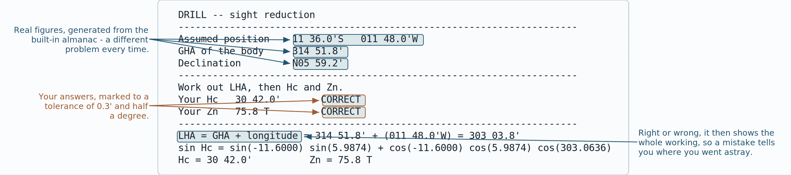

# CELNAV
## Celestial navigation in POSIX shell, for the iPad mini

**Version 1.1** — self-contained, offline, no almanac to buy and nothing that expires.
With a training mode that teaches the subject from first principles.

---

## 1. What this is, and why it is built this way

CELNAV takes sextant altitudes and gives you a fix, with the full working shown and the
solution drawn on screen. It is one shell script. It needs no internet, no downloaded
almanac, no Python, and no libraries.

Four constraints shaped the design, and each one has a consequence worth knowing.

**1. It must work when nothing else does.**
Consequence: the almanac is *computed*, not looked up. The positions of the Sun, Moon,
four planets and 58 stars come from orbital theory built into the script. There is no
data file to lose, no table that runs out at the end of the year, and no year in which
you need a new edition.

**2. It must run on whatever shell an iPad can be persuaded to give you.**
Consequence: the whole program is POSIX `sh` plus `awk`, the largest common denominator
across iSH, a-Shell, Termux, macOS and Linux. Nothing is assumed beyond the shell and an
`awk` with trigonometric functions. There is no compiler step and no package to install.

**3. It must be one file.**
Consequence: `celnav` carries its own computation engine inside it as text. The first
time you run it, it writes that engine out to `~/.celnav/` and uses it from there. Moving
the app to a new device is moving one file.

**4. The working must be visible.**
Consequence: every intermediate value is printed — GHA, declination, LHA, dip,
refraction, parallax, semi-diameter, Hc, Zn, intercept. If a fix looks wrong you can see
where it went wrong, and you can check any line of it by hand against a paper almanac.
The program is a fast, tireless assistant, not a black box.

---

## 2. Installing on the iPad mini

There are two good ways to get a shell on an iPad. **iSH** gives you a full Alpine Linux
and a package manager. **a-Shell** is faster and easier on the battery but has a fixed
set of commands. CELNAV runs on both.

Follow the route you are using. Run **one block at a time** and check the output before
moving on.

### Route A — iSH (Alpine Linux)

**A1. (changes things)** Install an `awk` that has trigonometry compiled in. The `awk`
inside iSH's BusyBox is sometimes built without the maths library, and CELNAV cannot work
without `sin`, `cos` and `atan2`.

```
apk update && apk add gawk
```

**A2. (read-only)** Confirm the maths works. This must print a number near `0.7854`.

```
gawk 'BEGIN{print atan2(1,1)}'
```

**A3. (changes things)** Put `celnav` where you can run it, and make it executable. Copy
the file into iSH first — in iSH, `mount -t ios . /mnt` lets you reach the Files app, or
use whatever transfer you already trust.

```
mkdir -p ~/bin && cp celnav ~/bin/celnav && chmod +x ~/bin/celnav
```

**A4. (changes things)** Add `~/bin` to your path so you can type `celnav` anywhere.

```
echo 'export PATH="$HOME/bin:$PATH"' >> ~/.profile && . ~/.profile
```

**A5. (read-only)** Check the installation end to end.

```
celnav doctor
```

You should see `awk maths : OK`, a writable data directory, the UTC clock, and
`ALL TESTS PASSED` from the self test.

### Route B — a-Shell

a-Shell already includes a suitable `awk`, so there is nothing to install.

**B1. (changes things)** Bring `celnav` into a-Shell's own document folder — the folder
that appears under *On My iPad* in the Files app is the simplest path.

**B2. (changes things)** Make it executable and confirm where you are.

```
chmod +x celnav && pwd
```

**B3. (read-only)** Run the environment check.

```
./celnav doctor
```

In a-Shell you will usually run it as `./celnav` from that folder rather than installing
it on a path.

### Verifying the file arrived intact

**(read-only)** The script is about 140 kB. A truncated transfer will fail the self test
rather than give you quiet nonsense, but you can also check the file directly:

```
cksum celnav
```

Expected for version 1.1: `4175943417 142889 celnav`.

---

## 3. The screen

Starting `celnav` with no arguments gives you the menu. Everything on it also has a
command-line form, listed in section 5.


---

## 4. The working cycle at sea

**Step 1 — tell it where you think you are.**
Menu item **6**, or `celnav dr "35 10.4 N" "040 20.1 W" 245 11`. The last two numbers are
course made good in degrees true and speed over ground in knots. Consequence: with a
course and speed set, every line of position is advanced to the fix time automatically,
so sights taken an hour apart still give one fix.

**Step 2 — plan the round before you go on deck.**
Menu item **3**, or `celnav plan`. You get twilight times in both UT and local mean time,
the moon's phase, every body above five degrees with altitude and azimuth, a sky diagram,
and a suggested set of three with the widest azimuth spread. Consequence: you go up with
a list, not a hope.


**Step 3 — shoot, and write down the time to the second.**
Time is what matters most. Four seconds of clock error is about one mile of longitude.
Everything else in the chain is smaller than that.

**Step 4 — enter each sight.**
Menu item **1**, or
`celnav sight "2026-08-29 07:30:00" Dubhe C "19 32.1" 1.5 3.0`
(UT, body, limb, Hs, index error in minutes, height of eye in metres). Sights accumulate
in a log until you clear them.

**Step 5 — reduce and plot.**
Menu item **2**, or `celnav fix`. You get the full working for each sight, the fix, the
residuals, a sky view and the intercept plot.

**Step 6 — read the geometry line before you believe the fix.**
CELNAV tells you how far one arcminute of sight error moves the fix, and in which
direction. Consequence: a fix from three bodies bunched in one quarter of the sky is
reported as weak *before* you steer on it.

**Step 7 — clear the log.**
Menu item **7**, then `c`. Or `celnav clear`.

---

## 5. Command reference

Everything in the menu has a command-line equivalent, so you can script it or get a
single answer without navigating menus.

| Command | What it does |
|---|---|
| `celnav` | interactive menu |
| `celnav plan ["UT"]` | twilight, moon, visible bodies, best three, sky diagram |
| `celnav alm ["UT"] [bodies]` | GHA, Dec, SD, HP for the bodies you name |
| `celnav sight "UT" body limb Hs [IE] [eye]` | record one sight |
| `celnav fix ["UT of fix"]` | reduce the log, compute the fix, draw the plot |
| `celnav compass "UT" body <bearing> [variation]` | compass error and deviation |
| `celnav stars ["UT"]` | the 57 navigational stars plus Polaris, SHA and Dec |
| `celnav dr <lat> <lon> [course] [speed]` | set the DR |
| `celnav log` / `celnav clear` | list or empty the sight log |
| `celnav doctor` | environment check plus self test |
| `celnav test` | self test only |
| `celnav where` | show file locations |
| `celnav reinstall` | rewrite the engine after replacing the script |
| `celnav learn` | the training menu |
| `celnav lesson <code>` | one lesson, e.g. `celnav lesson R3` |
| `celnav walk` | the annotated walkthrough of a real sight |
| `celnav drill [type]` | a marked drill; type is corr, alm, red, int, full or fix |
| `celnav sandbox` | the what-if triangle |
| `celnav syllabus` | the lesson list with your progress |
| `celnav day` / `night` / `plain` | colour mode |

**Angle formats.** All of these are understood, anywhere an angle is asked for:

```
35 10.4 N        040 20.1 W        -35.1733        040:20.1W        35d10.4'N
```

Altitudes are degrees and decimal minutes: `32 14.6`. A single number with a decimal point
is read as decimal degrees.

**Time formats.** `2026-08-29 07:30:00` everywhere. In the menu you may type just `073000`
or `07:30:00` and today's UT date is assumed.

**Limb.** `L` lower limb, `U` upper limb, `C` centre — use `C` for stars and planets.

---

## 6. How the numbers are made

This section is the reasoning behind the answers, so that you can check them and so that
anyone maintaining the script knows what each part is for.

### 6.1 Time

1. Your UT date and time become a Julian Date.
2. Greenwich apparent sidereal time follows from it, including nutation, which gives the
   GHA of Aries directly.
3. Body positions are computed at Terrestrial Time, which is UT plus Delta-T. CELNAV
   models Delta-T as about 69 seconds in the mid 2020s, rising slowly. Consequence: an
   error of even 30 seconds in Delta-T moves the Moon by 0.3 arcminutes and everything
   else by far less, so this is never the weak link.

### 6.2 The almanac

Different bodies need different treatment, and each choice has a reason.

1. **Stars** come from a J2000 catalogue of the 57 navigational stars plus Polaris, with
   proper motion, precession, nutation and annual aberration applied to the date.
   Measured accuracy: better than 0.02 arcminutes.
2. **The Sun and planets** come from Keplerian orbital elements corrected by a fitted
   series of periodic terms. The raw elements alone leave Saturn several arcminutes out,
   because of its long-period resonance with Jupiter; the correction series removes that.
   Consequence: Saturn is now the *most* accurate of the planets rather than the worst.
3. **The Moon** uses the full main-problem lunar series — sixty terms in longitude and
   distance, sixty in latitude. The Moon earns this because it moves half a degree an
   hour and has a parallax approaching a degree; a coarse Moon would be the largest error
   in the whole program.

### 6.3 Sextant corrections

Applied in this order, and each one printed so you can check it.

1. **Index error** — as you enter it, positive meaning on the arc.
2. **Dip** — 1.76 times the square root of the height of eye in metres, in arcminutes.
   This gives apparent altitude, `Ha`.
3. **Refraction** — Bennett's formula, scaled for temperature and pressure. Consequence:
   a real temperature and pressure matter mainly for low sights; above about 25 degrees
   the whole adjustment is a tenth of a mile.
4. **Parallax in altitude** — horizontal parallax times the cosine of `Ha`. Negligible
   for the Sun, up to about an hour of arc for the Moon.
5. **Semi-diameter** — added for a lower limb, subtracted for an upper limb. For the Moon
   it is augmented as the Moon rises, because you are nearer to it when it is overhead.

The result is `Ho`, the observed altitude: what a perfect observer at the centre of the
Earth would have measured.

### 6.4 Sight reduction

No tables, and no assumed position rounded to a whole degree. CELNAV computes the
navigational triangle directly at your DR:

```
LHA = GHA + longitude (east positive)
Hc  = asin( sin L sin d + cos L cos d cos LHA )
Zn  = atan2( -cos d sin LHA ,  cos L sin d - sin L cos d cos LHA )
```

The intercept is `(Ho - Hc)` in minutes, which is miles; positive means the true position
lies *toward* the body from your DR.


Consequence of computing rather than tabulating: your DR is used as it stands, the
intercepts stay small, and the answer does not depend on which assumed position you
happened to pick.

### 6.5 The fix

Each line of position says that the offset of the true position from the DR, in miles
north and east, satisfies

```
dN cos Zn + dE sin Zn = intercept
```

With two or more sights this is solved by least squares, so every sight contributes and
none is privileged. Then:

1. The answer becomes the new assumed position, and the whole reduction runs again.
2. That repeats until the position stops moving.


Consequence: the known weakness of the intercept method — that it is a straight-line
approximation to a circle, and drifts when the DR is far out or the body is high — is
removed. Tested against exact synthetic sights worldwide, the converged fix lands within
0.11 miles of truth even from a DR 25 miles out.

### 6.6 Running fix

For each sight, the assumed position is your DR at fix time *run backwards* along your
course and speed to the time of that sight. Because the vessel and the assumed position
move together, the offset of the fix from the DR is the same quantity for every sight,
and they combine directly.

Consequence: sun-run-sun, a morning sun line crossed with a noon latitude, or a spread of
star sights taken over twenty minutes at speed — all work with no separate "advance the
LOP" step on your part. Set course and speed and it is done.

### 6.7 Fix geometry

From the same normal equations that give the fix, CELNAV computes the error ellipse for
one arcminute of sight error, and reports its long axis and the bearing of that axis.

- Under about 1.6 miles: a sound cut.
- 1.6 to 3 miles: fair; a body more nearly at right angles would tighten it.
- Over 3 miles: reported as a weak cut, with the advice to add a body 40 to 120 degrees
  away in azimuth.
- Parallel lines of position: refused outright, with an explanation.

Consequence: you are told how far to trust the fix, in miles, at the moment you get it.

---

## 7. Learning and practising

Menu item **9**, or `celnav learn`. It is built on the same engine as the rest of the
program, so a lesson and the working tool can never drift apart — the diagrams are drawn
by the same code that draws your fix, and the drill problems come from the same almanac.

There are two tracks. The **teaching track** starts from nothing and builds up; the
**practice track** gives you problems and marks them. You can use either without the other.


### 7.1 Lessons

Twenty lessons in four modules of five. Each one is a diagram, a short explanation in
numbered steps, and a question to check that it landed. Answer the question correctly and
the lesson is ticked off.

    FOUNDATIONS            what a sight measures, the geographical position,
                           the circle of position, the fix, and why we draw
                           a straight line instead of a circle
    TIME AND THE ALMANAC   UT and the cost of clock error, GHA and declination,
                           Aries and SHA, LHA
    SEXTANT                taking a sight, index error and dip, refraction,
                           semi-diameter and parallax, and the size of each
    REDUCTION AND THE FIX  the assumed position and the triangle, Hc and Zn,
                           the intercept, plotting, crossing and running


### 7.2 The walkthrough

`celnav walk` takes one real sight — the Dubhe sight from the appendix — and goes through
it in ten steps, computing each value as it explains why that line exists. It is the
fastest way to see the whole method end to end, and it is the same arithmetic the program
runs on your own sights.

### 7.3 Drills

`celnav drill` generates problems from the real almanac, with a different one every time,
and marks your answer:

| Drill | You are given | You work out |
|---|---|---|
| corrections | Hs, index error, height of eye, temperature, pressure | Ho |
| almanac | a body and a time | GHA and declination |
| reduction | assumed position, GHA, declination | LHA, Hc and Zn |
| intercept | Ho and Hc | miles, toward or away |
| complete sight | everything, from the sextant reading | the intercept and azimuth |
| three-star fix | three azimuths and intercepts | the position |

Tolerances are 0.3 minutes on an altitude, half a degree on an azimuth, and two miles on a
fix. Right or wrong, the full working is printed afterwards, so a mistake tells you exactly
where you went astray. Your running score is kept.



### 7.4 The sandbox

`celnav sandbox` draws the navigational triangle on your own sky and lets you change one
thing at a time — your latitude, the declination, or the LHA — and watch the shape move
and Hc and Zn change with it. Set LHA to zero and you are looking at a noon sight; set the
declination equal to your latitude and the body passes through your zenith.


---

## 8. Colour and night vision

Three modes, set from the menu with `c`, or with `celnav day`, `celnav night`,
`celnav plain`. The choice is remembered.

- **day** — black background, white text. The assumed position, the fix and the
  recommended bodies are picked out in green, and the matching symbol in each key is
  drawn in the same colour, so the legend reads as a colour match rather than a list.
- **night** — black background, deep red text, with the same highlights in bright red
  instead of green. There is deliberately no green in night mode: it takes about twenty
  minutes to get your night vision back, and a white or green screen at 0300 costs you
  every one of them. Red light at low brightness costs you almost nothing.
- **plain** — no escape sequences at all. Use it when piping output to a file or a
  printer, and note that CELNAV switches to it automatically whenever its output is not a
  terminal, so a redirected fix is always clean text.

---

## 9. Accuracy — what was actually measured

The almanac was checked against an independent high-precision ephemeris over 1990–2076,
sampling every 11 days. Errors are the total angular difference in apparent position, in
arcminutes.

| Body | RMS error | Worst case | Notes |
|---|---|---|---|
| Navigational stars | 0.005' | 0.011' | all 58 checked |
| Sun | 0.06' | 0.22' | |
| Moon | 0.11' | 0.33' | measured over 2024–2036 |
| Venus | 0.09' | 0.42' | worst near inferior conjunction, when it is unobservable |
| Mars | 0.06' | 0.35' | worst near opposition |
| Jupiter | 0.03' | 0.06' | |
| Saturn | 0.01' | 0.03' | |

**What this means in practice.** One arcminute is one mile. The almanac contributes well
under half a mile everywhere, and under a tenth of a mile for stars. A good sextant
observation from a small vessel is worth one to two miles. The almanac is therefore not
your limiting factor, and will not become one.

**The fix arithmetic** was checked separately by generating exact sights for 200 random
positions worldwide — all latitudes to 80 degrees, all longitudes, 2026 to 2033, running
fixes at up to 14 knots — reducing them from a DR up to 25 miles away, and comparing the
answer to the known truth. Every case with sound geometry came back within **0.11 miles**.
The only cases that did not were ones where the lines of position were nearly parallel,
and CELNAV reports those as weak cuts.

**The self test travels with the app.** `celnav test` re-checks fourteen reference
positions and the reduction arithmetic against values embedded in the script. It runs
offline in about a second and tells you the worst error it found. Run it whenever you
doubt the answers.

---

## 10. Limits and cautions

1. **Validity window.** The planetary correction series was fitted over 1985–2080 and is
   accurate throughout. Outside that span accuracy degrades gracefully but is not
   guaranteed. Stars, Sun and Moon remain good well beyond it.
2. **Your clock is the weak link.** CELNAV cannot know that your watch is wrong. Set it
   against a known source and note the rate. Four seconds is a mile.
3. **Low sights.** Below about 15 degrees, refraction becomes uncertain because it depends
   on the real temperature profile over the sea rather than on the standard model. CELNAV
   flags these in the planning list. Prefer bodies above 15 degrees when you have the
   choice.
4. **Very high sights.** Above about 75 degrees the azimuth changes quickly with position
   and the line of position is noticeably curved. The iterated fix handles this correctly,
   but the *plot* is a straight-line drawing, so in that case trust the printed fix over
   the picture.
5. **This is a check on your own work, not a replacement for it.** Carry the tables and
   know how to use them. A single script on a single device is a single point of failure;
   the reason the working is printed in full is so that you can continue by hand from any
   line of it.

---

## 11. Files and formats

| Path | What it is |
|---|---|
| `~/.celnav/engine-1.1.awk` | the computation engine, written out on first run |
| `~/.celnav/teach-1.1.awk` | the training module |
| `~/.celnav/progress` | which lessons you have done and how the drills have gone |
| `~/.celnav/sights.txt` | the sight log |
| `~/.celnav/celnav.conf` | DR, course, speed, height of eye, index error, temperature, pressure, colour mode |

Set `CELNAV_HOME` to put these elsewhere. Set `CELNAV_AWK` to force a particular `awk`,
for example `CELNAV_AWK=gawk celnav`.

**Sight log format** — one sight per line, fields separated by `|`, `#` for comments. You
can edit it in any text editor:

```
UT                  |body     |limb|Hs      |IE |eye|temp|press|label
2026-08-29 07:30:00 |Dubhe    |C   |19 32.1 |1.5|3.0|18  |1013 |morning stars
```

---

## 12. Troubleshooting

**"no awk with trigonometric functions was found"**
Your `awk` was built without the maths library. On iSH: `apk add gawk`. On Termux:
`pkg install gawk`. Then run `celnav doctor` again.

**The self test fails.**
The most likely cause is a truncated file transfer. Check `cksum celnav` against the value
in section 2 and re-copy the file if it differs.

**"Single line of position only".**
You have one sight, or several on the same azimuth. Add a body well away in azimuth.

**The fix is a long way from the DR.**
That is fine — the iterated reduction is exact regardless of distance. But read the
residuals: if they are large, one sight is wrong. Check the *time* of each sight first. A
transposed digit in the seconds is the commonest error, and it moves only the longitude.

**The plot looks cluttered.**
It is scaled automatically to fit the largest intercept, so if one sight has a very large
intercept the others are squeezed together — which is usually the plot telling you that
one sight is bad.

---

## Appendix — a worked example

Three star sights at morning twilight in the North Atlantic, from a DR of
35 00.0'N 040 00.0'W, no way on.

```
celnav dr "35 00 N" "040 00 W" 0 0
celnav sight "2026-08-29 07:30:00" Dubhe     C "19 32.1" 1.5 3.0
celnav sight "2026-08-29 07:34:00" Bellatrix C "49 37.2" 1.5 3.0
celnav sight "2026-08-29 07:38:00" Markab    C "29 01.3" 1.5 3.0
celnav fix
```

CELNAV prints the full working for each sight, then:

```
  FIX   35 09.9'N   040 20.0'W
  Offset from DR: 9.9 nm N, 16.4 nm W   (19.2 nm on 301 T)

  LOP residuals at the fix (nm):
    a Dubhe      Zn 027 T   intercept from DR    1.5   residual  +0.01
    b Bellatrix  Zn 128 T   intercept from DR  -19.0   residual  +0.01
    c Markab     Zn 269 T   intercept from DR   16.2   residual  +0.01
    RMS scatter 0.01 nm  -  this is the quality of your sights

  GEOMETRY: 1.0' of sight error puts the fix out by 0.9 nm along 185 T
            and 0.7 nm across it.  (3 LOPs)
```

The sights here were generated exactly, so the residuals are effectively zero; with real
sights the RMS scatter is your own observing error, and it is the honest measure of how
good the round was.

Then the sky view — where the three bodies were when you shot them:

```
  SKY VIEW  (centre = overhead, rim = horizon, N up, E right)
                              N
                       *****************
                 ******                 ******
             *****                           *****
           ***                           a       ***
         **            .................            **
       **          ....                 ....          **
      **        ....                       ....        **
     *         ..           .......           ..         *
    *        ...        .....     .....        ...        *
   **        .         ..             ..         .        **
   *        ..        .          zenith .        ..        *
  W*        c         .        +        .         .        *E
   *        ..        .                 .        ..        *
   **        .         ..             ..         .        **
    *        ...        .....     .....  b     ...        *
     *         ..           .......           ..         *
      **        ....                       ....        **
       **          ....                 ....          **
         **            .................            **
           ***                                   ***
             *****                           *****
                 ******                 ******
                       *****************
                              S
  inner rings = 60 and 30 degrees altitude
```

and the intercept plot — the plotting sheet, drawn in characters:

```
  INTERCEPT PLOT  (AP at centre, N up)
                               |    N :          //
                               |      :        //
                               |      :      //
  -                            |      :     //
  ----                         |      :   //
      ----                     |      :  //
          ----                 |      ://
              ----             |     ///
                  ----         |    //:
                      ----     |  //  :
                          ---- | //   :
                              -@b-.   :
  W                           /|  ----:                                   E
  ..........................//..c.....+a--.................................
                          //    |     :   ----
                         //     |     :      -----
                       //       |     :          -----
                      //        |     :              -----
                    //          |     :                  -----
                   //           |     :                      -----
                 //             |     :                          -----
               //               |     :                              -----
              //                |     :                                  --
            //                  |     :
           //                   |     :
         //                     |     :
       ///                      |   S :                       5 nm per row
  AP = +    LOP = lettered line    fix = @    1 row = 5 nm, 1 column = 2.5 nm

      body         Zn       intercept  LOP
  a   Dubhe        027 T       1.5 nm  toward Ho 19 24.8'  Hc 19 23.3'
  b   Bellatrix    128 T      19.0 nm  away   Ho 49 31.8'  Hc 49 50.8'
  c   Markab       269 T      16.2 nm  toward Ho 28 55.0'  Hc 28 38.8'
```

Read it like a plotting sheet. The `+` at the centre is your DR. Each lettered line is one
line of position, drawn at right angles to that body's azimuth, and the letter sits at the
foot of its intercept. The `@` is the fix. Here it lies up and to the left of the DR —
about 10 miles north and 16 miles west — which is what the figures above the plot say in
words.

The same three sights taken while making 9 knots on 060 T, from a DR of 35 05.0'N
040 15.0'W, are reduced the same way once the run is set — each line of position is
advanced to the fix time for you, and the answer comes back on the same position.
