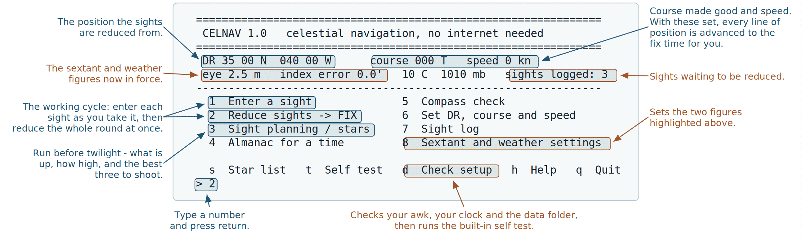
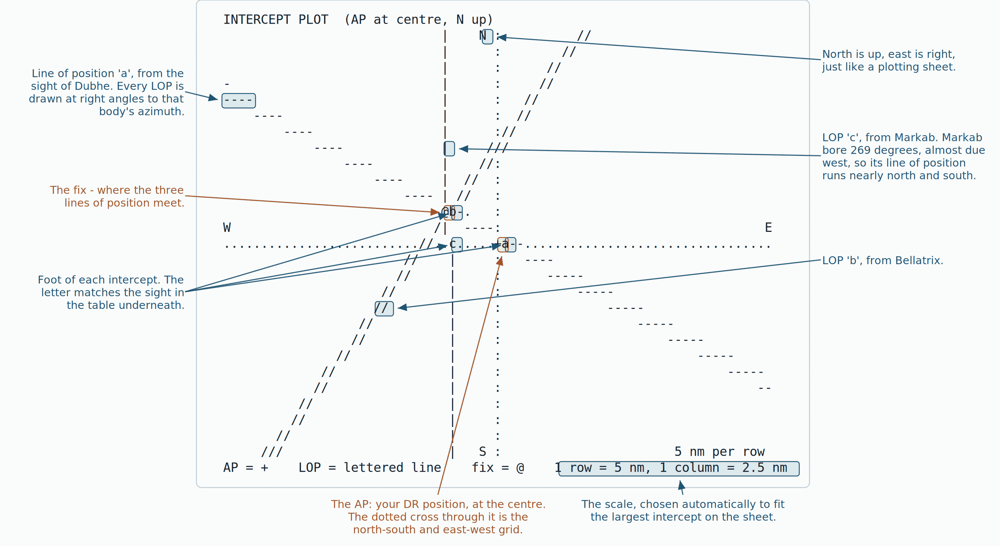

# CELNAV quick reference

**Menu:** run `celnav`. **Everything also works from the command line.**

| | |
|---|---|
| `celnav dr "35 10.4 N" "040 20.1 W" 245 11` | set DR, course true, speed |
| `celnav plan` | twilight, what is up, best three |
| `celnav sight "2026-08-29 07:30:00" Dubhe C "19 32.1" 1.5 3.0` | UT, body, limb, Hs, index error, eye height |
| `celnav fix` | reduce the log and plot the fix |
| `celnav compass "UT" sun 112.5 6.0` | compass error and deviation |
| `celnav log` / `celnav clear` | list / empty the sight log |
| `celnav doctor` | environment check and self test |
| `celnav learn` | lessons, walkthrough, drills, sandbox |
| `celnav drill red` | one marked drill (corr, alm, red, int, full, fix) |
| `celnav night` / `day` / `plain` | colour mode |

**Menu keys:** 1 sight · 2 fix · 3 plan · 4 almanac · 5 compass · 6 DR · 7 log · 8 settings · 9 learn · s stars · t test · d check · c colour · h help · q quit

---

## Order of work

1. **DR** — position, course made good, speed. Without course and speed the sights are not advanced.
2. **Plan** — before twilight. Note the three bodies and their approximate altitudes so you can find them fast.
3. **Shoot** — record UT to the second. *Four seconds is one mile of longitude.*
4. **Enter** each sight. Limb: `L` lower, `U` upper, `C` centre (stars and planets).
5. **Fix** — read the residuals and the geometry line before you use it.
6. **Clear** the log.

## Reading the answer

- **Intercept** — miles from your DR toward (+) or away (−) from the body.
- **Residual** — how far each line of position misses the fix. This is your observing error. Under a mile is good work.
- **RMS scatter** — the same thing for the round as a whole.
- **GEOMETRY** — how far one arcminute of sight error moves the fix. Under 1.6 nm is a sound cut; over 3 nm is a weak one and CELNAV says so.

## Formats

```
Angles     35 10.4 N     040 20.1 W     -35.1733     040:20.1W
Altitude   32 14.6       (degrees and decimal minutes)
Time       2026-08-29 07:30:00 UT   (or 073000 in the menu, today's date assumed)
```

<div class="pagebreak"></div>

## The screen





**Reading the plot:** `+` is your DR at the centre of the sheet · each lettered line is a line of position, drawn at right angles to that body's azimuth · the letter sits at the foot of its intercept · `@` is the fix · the scale is printed at the bottom right and is chosen to fit the largest intercept.

<div class="pagebreak"></div>

## The sky view


## When something is wrong

| Symptom | First thing to check |
|---|---|
| Fix far from DR with large residuals | the **time** of each sight — a wrong digit in the seconds moves longitude only |
| "Single line of position only" | two sights on nearly the same azimuth — add a body 40–120° away |
| "no awk with trigonometric functions" | `apk add gawk` on iSH, `pkg install gawk` on Termux |
| Self test fails | the file transfer truncated — check `cksum celnav` |

## Colour

`c` in the menu, or `celnav day` / `night` / `plain`.

- **day** — white on black, highlights in green.
- **night** — deep red on black, highlights in bright red. No green at night: twenty
  minutes of dark adaptation is not worth a prettier screen.
- **plain** — no escape sequences; chosen automatically when output is not a terminal.

## Learning it

`celnav learn`, or menu item 9.

- **Lessons** — twenty, in four modules, from what a sight measures to what makes a cut weak. Each ends with a question; answer it and the lesson is ticked off.
- **Walkthrough** — one real sight in ten steps, every line explained as it is computed.
- **Drills** — problems built from the real almanac and marked, with the full working shown afterwards. Types: `corr`, `alm`, `red`, `int`, `full`, `fix`.
- **Sandbox** — change latitude, declination or LHA and watch the navigational triangle move.

## Rules of thumb

- Prefer bodies between **15° and 70°** of altitude.
- Three bodies about **120° apart** in azimuth give the tightest fix.
- The **star horizon** is usable between civil and nautical twilight — a window of roughly twenty minutes.
- A sight of the Sun at any altitude gives a line; two of them, an hour or more apart, give a running fix.
